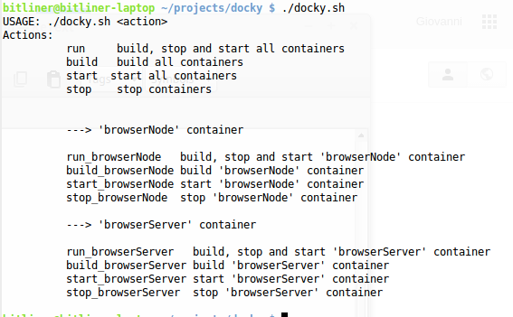
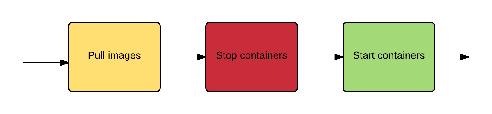

# This package is deprecated and outdated

# Docky - Toolkit for Docker

Docky generates **bash** scripts to manage multiple Docker containers.

Docker containers are described inside a Yaml file, following the same format of [docker-compose](https://docs.docker.com/compose/).

## Requirements

* [NPM - Node Package Manager](http://npm.org)
* Bash

## Installation

```js
npm install -g docky
```


## Usage

1. create  `docker-compose.yml` file. It looks like  
```
 web:
  build: .
  ports:
    - "5000:5000"
  volumes:
    - .:/code
  links:
    - redis
 redis:
   image: redis
```

2. run `docky ./docker-compose.yml` to generate `docky.sh` file
4. run `./docky.sh` to list avaiable commands

**Example of available commands**



## Workflow

### `run` command




## Commands

### Commands to manage all container at once

```sh
$ ./docky run # run all containers
```
```sh
$ ./docky start # start all containers
```
```sh
$ ./docky stop # stop all containers
```
```sh
$ ./docky build # build all images
```
```sh
$ ./docky push # push all images
```
```sh
$ ./docky pull # pull all images
```

### Commands to manage a single container 

Just add `_<container_name>` to the commands above to manage all containers at once.

```sh
$ ./docky run_<container_name> # run <container_name> container
```
```sh
$ ./docky start_<container_name> # start <container_name> container
```
```sh
$ ./docky stop_<container_name> # stop <container_name> container
```
```sh
$ ./docky build_<image_name> # build <image_name> image
```
```sh
$ ./docky push_<image_name> # push <image_name> image
```
```sh
$ ./docky pull # pull all images
```


